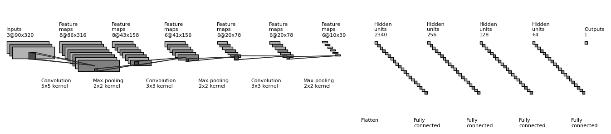

# Udacity Self-Driving Car Nanodegree

## Term 1 : Project 03 - **Behavioral Cloning**

---

The goals / steps of this project are the following:
* Use the simulator to collect data of good driving behavior
* Build, a convolution neural network in Keras that predicts steering angles from images
* Train and validate the model with a training and validation set
* Test that the model successfully drives around track one without leaving the road
* Summarize the results with a written report


### Files Submitted & Code Quality

#### 1. Submission includes all required files and can be used to run the simulator in autonomous mode

My project includes the following files:
* [model.py](./model.py) - script to create and train the model.
* [drive.py](./drive.py) - for driving the car in autonomous mode.
* [model.h5](./model.h5) - containing a trained convolution neural network 
* [writeup_report.md](./writeup_report.md) - THIS file is the Write Up report/summary.
* [P3_Model_Generator.ipynb](./P3_Model_Generator.ipynb) - Additionally, I have included the IPython Notebook I used to write the code.

#### 2. Submission includes functional code
The below code can be used to run the simulator in Autonomous mode with my trained model.
```sh
python drive.py model.h5
```
The driving behaviour of the car is seen to be greatly dependent on the hardware on which the simulator is being run. On testing this on a workstation without a GPU, the **drive.py** file had to be edited to change the **set_speed** variable to **4** instead of the default **9** (on line 47).

On running the simulation on a laptop with a GPU, it works fine with the default value of 9. In the submission, the **drive.py** file is included as-is as provided by Udacity without any modification.

#### 3. Submission code is usable and readable

The **model.py** contains all the code required to load the training data, create a model and train it using Keras and saving the model to disk. The code is commented with explanation wherever required.

### Model Architecture and Training Strategy

#### 1. An appropriate model architecture has been employed

The model consists of **three convolutional layers** and **three fully connected layers**. The model was chosen to be sufficiently complex to navigate the tracks, especially given that collecting accurate data was very challenging - (I decided to use only my own data and did not train on the Udacity provided data).

A detailed explanation of the model with visualization is provided in the following sections.

#### 2. Attempts to reduce overfitting in the model

1. **Dropout** is implemented in the three fully connected layers.
2. **Augmentation** is used by including the left and right camera images for training with a small adjustment of the steering angle.
3. Further, **Flipping** is done on all the images to increase the data and better generalize it.

#### 3. Model parameter tuning

The model uses an Adam optimizer but the initial learning rate was explicitly defined to be **0.005** which was experimentally found to help the model converge better.

#### 4. Appropriate training data

The Udacity training data was not used. I wanted to use my own data which I have recorded by attempting to drive along the center. Left and Right camera images were also used for recovery and flipping was done on all images to to counter turn-bias.

### Model Architecture and Training Strategy

#### 1. Solution Design Approach

I started with a sufficiently strong model which was giving low loss on both; training and validation data set. The real problem here was getting accurate data to train the model on.

Some features which improved the model are:

 * Lambda Layer
  ```python
  model.add(Lambda(lambda x: x/255.0 - 0.5, input_shape=(160,320,3)))
  ```  
* Cropping Layer
  ```python
  model.add(Cropping2D(cropping=((50,20), (0,0))))
  ``` 
* Early Stopping Callback
  ```python
  earlystop = EarlyStopping(monitor='val_loss', patience=3)
  ```
* Checkpoint Callback
  ```python
  checkpoint = ModelCheckpoint(filepath, monitor='val_loss', save_best_only=True)
  ```

#### 2. Final Model Architecture

Below is a diagrammatic representation of the model architecture generated using draw_convnet.<sup>[[1]](https://github.com/gwding/draw_convnet)



(It is better to download and view the image locally as it is difficult to read the details within the browser)

Note that this diagram does not illustrate the below listed features:
* Lambda layer for normalization
* Cropping layer
* Activation functions
* Dropout
* Loss Function

All details are included in the Keras generated summary representation of the model:


#### 3. Creation of the Training Set & Training Process

To capture good driving behavior, I first recorded two laps on track one using center lane driving. Here is an example image of center lane driving:

![alt text][image2]

I then recorded the vehicle recovering from the left side and right sides of the road back to center so that the vehicle would learn to .... These images show what a recovery looks like starting from ... :

![alt text][image3]
![alt text][image4]
![alt text][image5]

Then I repeated this process on track two in order to get more data points.

To augment the data sat, I also flipped images and angles thinking that this would ... For example, here is an image that has then been flipped:

![alt text][image6]
![alt text][image7]

Etc ....

After the collection process, I had X number of data points. I then preprocessed this data by ...


I finally randomly shuffled the data set and put Y% of the data into a validation set. 

I used this training data for training the model. The validation set helped determine if the model was over or under fitting. The ideal number of epochs was Z as evidenced by ... I used an adam optimizer so that manually training the learning rate wasn't necessary.
